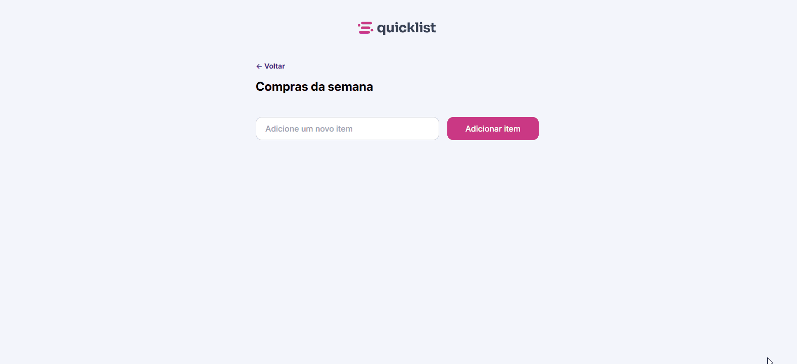

# 🛒 To-Do List – Lista de Compras  

Aplicação simples e interativa desenvolvida para gerenciar uma **lista de compras semanais** diretamente no navegador.  
O objetivo é transformar a experiência das tradicionais listas de papel em uma versão digital prática e funcional.  


## 🖼️ Prévia
<p align="center">
  
</p>

## 🚀 Funcionalidades
- ✅ Adicionar novos itens à lista  
- ✅ Marcar itens como concluídos  
- ✅ Remover itens individualmente  
- ✅ Interface intuitiva e responsiva  

## 🎯 Objetivo do Projeto
O projeto foi desenvolvido com foco em **praticar manipulação do DOM com JavaScript**, além de consolidar conceitos como:  
- Criação dinâmica de elementos  
- Delegação de eventos  
- Manipulação de classes CSS  
- Validação de inputs  

## 💻 Tecnologias utilizadas
- **HTML5**  
- **CSS3**  
- **JavaScript (ES6+)**

## 🎨 Design

O layout e protótipo do projeto foram desenvolvidos no Figma.  
Você pode conferir [clicando aqui](https://www.figma.com/community/file/1397279978314668489/lista-de-compras).

## ✨ Aprendizados

Durante o desenvolvimento, foram praticados conceitos de manipulação do DOM e lógica de programação em JavaScript, especialmente:

- Uso de **`closest`** para identificar elementos clicados  
- Implementação de **delegação de eventos** para lidar com itens dinâmicos  
- Criação de **IDs únicos** para elementos adicionados à lista  

## 📂 Como executar
1. Clone o repositório:  
   ```bash
   git clone https://github.com/danillo-fullstack/projeto-fullstack-lista-de-compras.git
2. Acesse a pasta do projeto
    ```bash
   cd nome-do-repo


## 📝 Licença

Este projeto está sob a licença **MIT**. Sinta-se livre para utilizá-lo e modificá-lo.